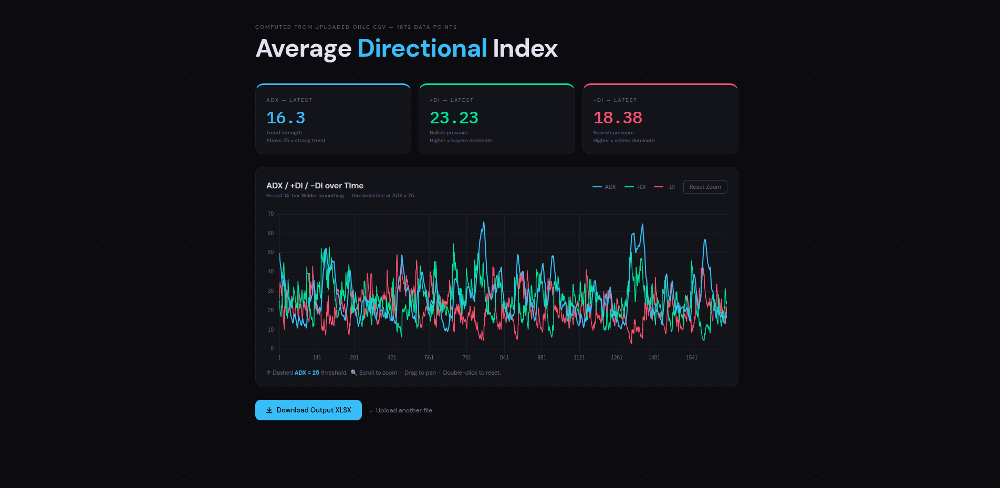

## How to Run

```bash
cd solution
pip install -r requirements.txt
python manage.py runserver
```

Open `http://127.0.0.1:8000/` in your browser.



# ADX Technical Indicator - Django Application

## Overview

This project implements the **ADX (Average Directional Index)** technical indicator as a Django web application. ADX is used by traders to identify profitable trading strategies by monitoring market trends.

## Features

- Upload a CSV file containing OHLC (Open, High, Low, Close) data via the index page
- Automatically computes all ADX-related calculations (+DI, -DI, ADX)
- Displays an interactive chart plotting **ADX**, **+DI**, and **-DI** on a results page
- Download the computed output as an XLSX file

## Getting Started

### Prerequisites

- Python 3.6
- `virtualenv`

### Installation

```bash
# Clone the repository
git clone <your-repo-url>
cd <repo-folder>

# Create and activate a virtual environment
virtualenv venv
source venv/bin/activate  # On Windows: venv\Scripts\activate

# Install dependencies
pip install -r requirements.txt
```

### Running the Application

```bash
python manage.py runserver
```

Then open your browser and navigate to `http://127.0.0.1:8000/`.

## Usage

1. On the **index page**, upload your input CSV file (`assignment1-data.csv`) using the file uploader.
2. The application will compute all ADX indicator values based on the required formulas.
3. The **results page** will display a line chart plotting ADX, +DI, and -DI over time.
4. Click the **"Download Output"** button to download the computed results as an XLSX file.

## Input Format

The input CSV file should contain the following columns:

- `Open`
- `High`
- `Low`
- `Close`

## Output

The downloaded XLSX will contain the full ADX computation columns, matching the solution defined in `assignment1-Solution.xlsx`.

## Project Structure

```
Inuvest Assessment test/
├── Doc/
│   └── Assignment1-data.csv
└── solution/
    ├── manage.py
    ├── Readme.md
    ├── requirment.txt
    ├── adx/
    │   ├── settings.py
    │   ├── urls.py
    │   └── wsgi.py
    ├── app/
    │   ├── urls.py
    │   ├── views.py
    │   └── templates/
    │       └── app/
    │           ├── index.html
    │           └── result.html
    └── static/
        └── css/
            └── style.css
```

## Dependencies

All dependencies are listed in `requirements.txt`. Install them using:

```bash
pip install -r requirements.txt
```

## Submission

- Submitted via GitHub public repository (master branch)
- Repository link shared via Cutshort/LinkedIn or emailed to vagaram@inuvest.tech

> **Note:** Only the `master` branch will be evaluated. Please ensure it is kept up to date.